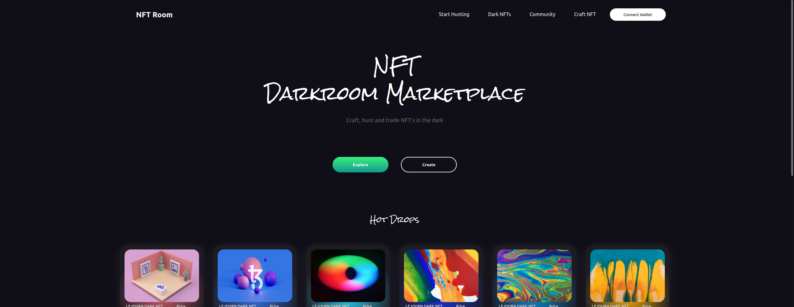
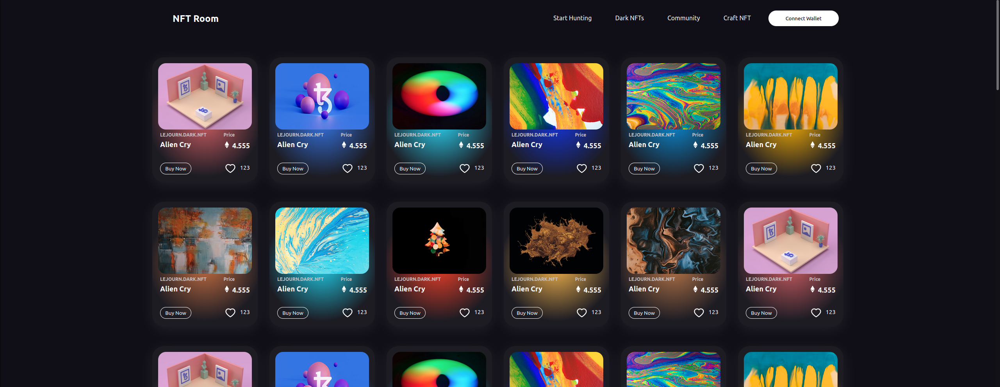

# Open Source Nft Marketplace [Onprogress %1]
<!-- ALL-CONTRIBUTORS-BADGE:START - Do not remove or modify this section -->

<!-- ALL-CONTRIBUTORS-BADGE:END -->
Reactjs And Smart Contracts Open Source Basic Nft Marketplace App

## 💪 Motivation

I aim to create an open and safe nft marketplace for everyone. This will be a challenge for both me and the contributors. Together we will create an open source, reliable and beautiful nft marketplace example. The purpose of this project is not to operate an nft marketplace, but to create a template for nft marketplaces. Thus, many nft marketplaces can be easily created by forking and modifying this template. This will be beneficial for us to support the artists. We can only succeed in the world by coming from different areas and joining our forces.

## 🖥️ Screenshoots 

### Home

### Explore

## 🎉 Roadmap

**Alpha Release Date 30 January 2022**
 - [x] Base Components (9/9)
 - [ ] Search Filters
 - [x] Connect Wallet (ETH Wallets)
 - [ ] NFT Detail Page (Date: 09 January 2022)
 - [ ] Smartcontract Backend
 - [ ] Community Page
 - [ ] Explore Page Tabs
 - [x] Login
 - [ ] Create Page
 - [ ] Users Pages
 - [ ] Collections

## 🔮 Usage
In the project directory, you can run:

### `npm install (for first running)`
### `npm start`

## 🗞️ Docs
Coming soon.

## 🤝 Contribute
If you want to contribute to this project, simply follow the steps in the contribution guide. I look forward to your contributions. 😊
[CONTRIBUTING.md](https://github.com/yessGlory17/nft-marketplace/blob/main/CONTRIBUTING.md)

## Contributors ✨

Thanks goes to these wonderful people ([emoji key](https://allcontributors.org/docs/en/emoji-key)):

<!-- ALL-CONTRIBUTORS-LIST:START - Do not remove or modify this section -->
<!-- prettier-ignore-start -->
<!-- markdownlint-disable -->
<table>
  <tr>
    <td align="center"><a href="https://github.com/GehadSalemFekry"> <b>Gehad Salem Fekry</b></a> <a href="#content-GehadSalemFekry" title="Content">🖋</a></td>
    <td align="center"><a href="https://github.com/digambar-t7"> <b>Digambar Tupurwadi</b></a> <a href="https://github.com/yessGlory17/nft-marketplace/issues?q=author%3Adigambar-t7" title="Bug reports">🐛</a></td>
  </tr>
</table>

<!-- markdownlint-restore -->
<!-- prettier-ignore-end -->

<!-- ALL-CONTRIBUTORS-LIST:END -->

This project follows the [all-contributors](https://github.com/all-contributors/all-contributors) specification. Contributions of any kind welcome!
